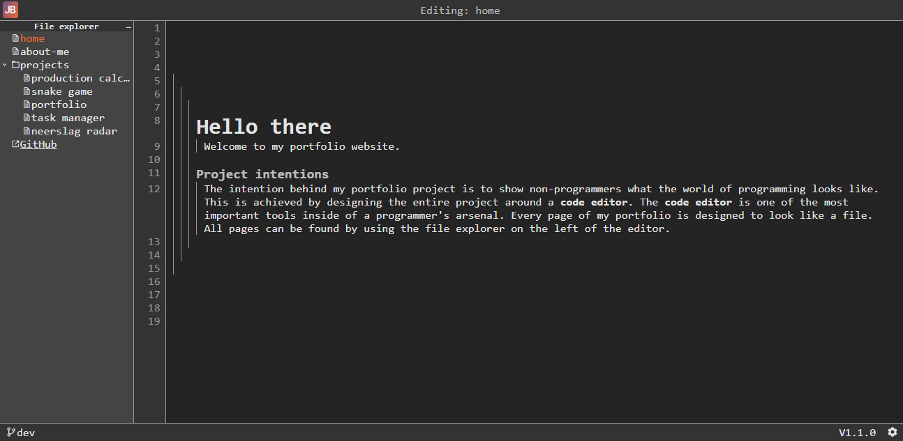
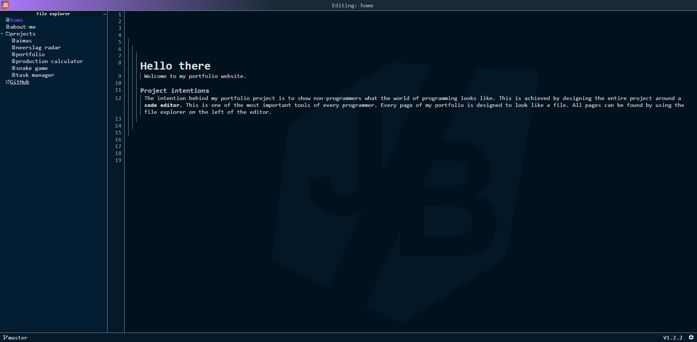
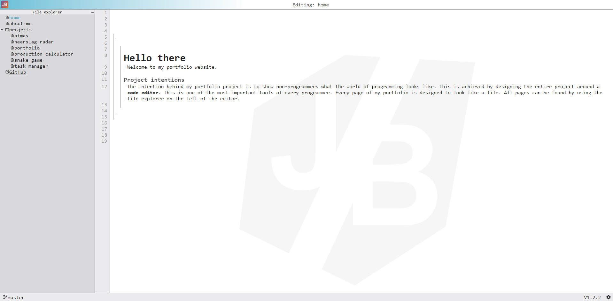

[](https://github.com/jordybronowicki37/portfolio/releases)
[](https://github.com/jordybronowicki37/portfolio/tags)
[](https://github.com/jordybronowicki37)
[](https://jordy-bronowicki-portfolio.onrender.com/)
```text
██████╗  ██████╗ ██████╗ ████████╗███████╗ ██████╗ ██╗     ██╗ ██████╗ 
██╔══██╗██╔═══██╗██╔══██╗╚══██╔══╝██╔════╝██╔═══██╗██║     ██║██╔═══██╗
██████╔╝██║   ██║██████╔╝   ██║   █████╗  ██║   ██║██║     ██║██║   ██║
██╔═══╝ ██║   ██║██╔══██╗   ██║   ██╔══╝  ██║   ██║██║     ██║██║   ██║
██║     ╚██████╔╝██║  ██║   ██║   ██║     ╚██████╔╝███████╗██║╚██████╔╝
╚═╝      ╚═════╝ ╚═╝  ╚═╝   ╚═╝   ╚═╝      ╚═════╝ ╚══════╝╚═╝ ╚═════╝ 
```

# Portfolio project
The intention behind my portfolio project is to show non-programmers what the world of programming looks like.
This is achieved by designing the entire project around a code editor. The code editor is one
of the most important tools inside of a programmer's arsenal. Every page of my portfolio is designed to look
like a file. All pages can be found by using the file explorer on the left of the editor.

## Themes
The editor supports multiple different themes.
### Default theme (Dracula)

### Dark Blue Theme

### Light Theme

