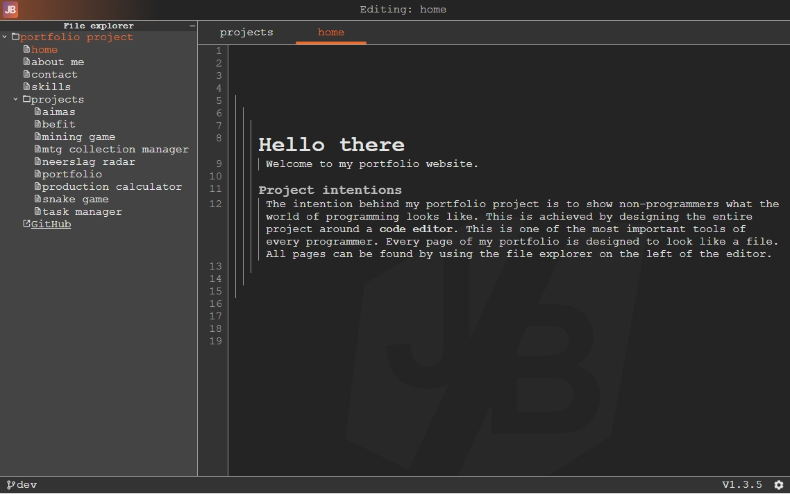
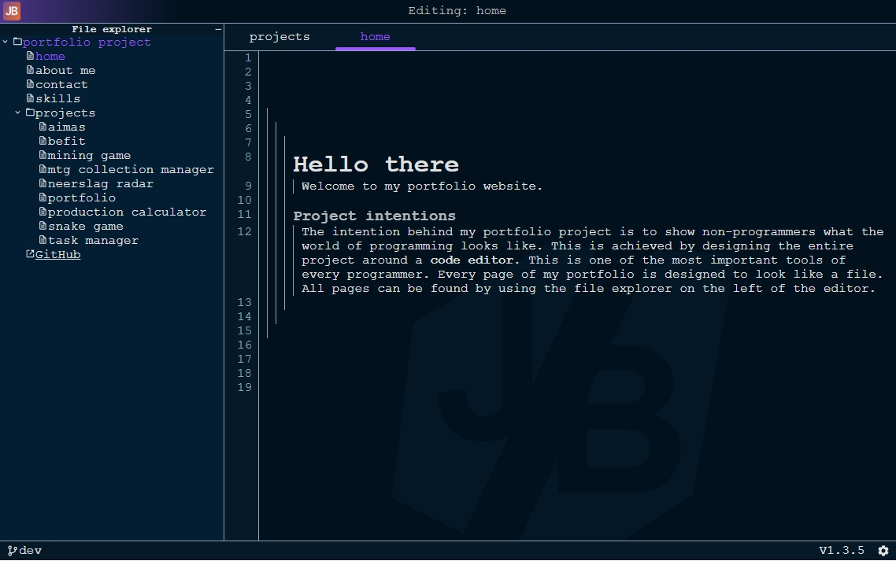
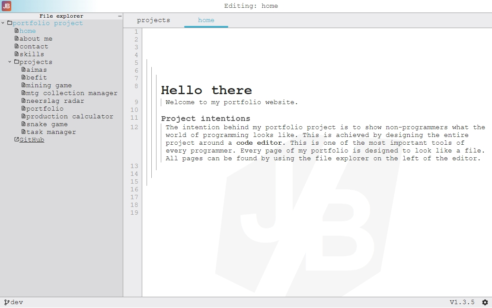

# Portfolio project
The intention behind my portfolio project is to show non-programmers what the world of programming looks like.
This is achieved by designing the entire project around a code editor. The code editor is one
of the most important tools inside of a programmer's arsenal. Every page of my portfolio is designed to look
like a file. All pages can be found by using the file explorer on the left of the editor.

## Themes
The editor supports multiple different themes.
### Default theme (Dracula)

### Dark Blue Theme

### Light Theme

